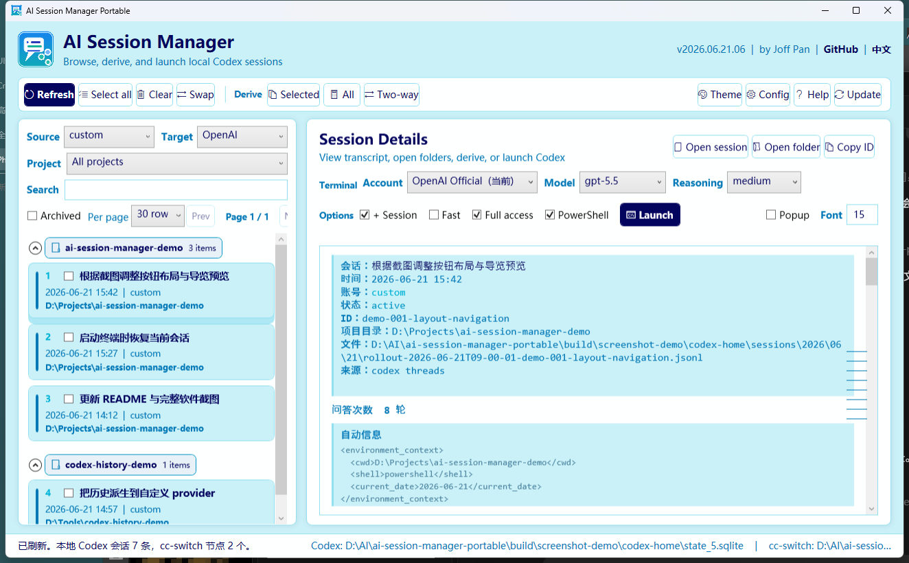

# AI Session Manager Portable

[](#requirements)
[](#requirements)
[](#requirements)
[](#data-layout)
[](#quick-start)
[](#privacy-and-safety)

Languages: [English](README.md) | [简体中文](README.zh-CN.md)

AI Session Manager Portable is a small Windows utility for viewing, launching, and deriving local AI tool sessions. It currently focuses on Codex Desktop local sessions and is starting to integrate the Codex / Claude Code session index captured by cc-switch.

It is designed for people who switch Codex providers often and want the same local threads to remain visible across accounts without manually moving database rows or editing rollout files.

## Screenshot



The screenshot uses temporary demo data and demo local paths only. The Chinese UI screenshot is in [README.zh-CN.md](README.zh-CN.md).

## Project Card

| Field | Value |
| --- | --- |
| Project type | Local desktop utility |
| Target platform | Windows |
| Interface | Native C#/.NET WPF GUI plus PowerShell CLI backend |
| Data source | Local Codex `state_5.sqlite` and `sessions\rollout-*.jsonl` files |
| Network use | None for history sync |
| Write behavior | Copies or updates local history entries after confirmation |
| Backup behavior | Creates timestamped backups before modifying Codex files |
| Portable dependency | Bundled `sqlite3.exe` |

## TL;DR

1. Download or clone this project.
2. Run `ai-session-manager-portable.exe` directly.
3. Pick a source provider and target provider.
4. Select the threads you want, then click `派生勾选`, or use `派生全部`.
5. The tool backs up Codex state before writing.

## Why This Exists

Codex Desktop stores local thread metadata in a SQLite database and places transcript rollout files under a `sessions` directory. The desktop UI separates those threads by the `threads.model_provider` value. If one provider writes history under `openai` and another writes under `custom`, the same local conversation can appear in one account bucket but not another.

This project automates the safe version of that migration:

- It keeps the original source thread.
- It creates or updates a destination copy.
- It rewrites the copied thread id inside the rollout file.
- It updates the target `model_provider`.
- When cc-switch is available, GUI derive uses the destination cc-switch node to rewrite `model`, `reasoning_effort`, and continuation metadata in the copied rollout.
- For non-official nodes, GUI derive enables proxy compatibility cleanup by removing official Codex-only reasoning and function/custom tool response items that can make routers such as Any Router or RightCode reject continued chats with `invalid codex request`.
- It records clone mappings so repeated derives update existing copies instead of creating duplicates.

## Features

- Native WPF GUI for browsing and deriving recent Codex threads.
- Session list paging, search, workspace filtering, archive filtering, and provider color accents.
- Session rows are grouped by workspace folder, with collapsible project sections.
- The detail view supports text selection, collapsed response groups, font-size control, and a right-side navigation preview.
- CLI for provider listing, one-off clone, one-way derive, two-way mirror derive, and mapping registration.
- Directory filter for deriving only threads from a selected workspace path.
- Automatic Codex history discovery from common local locations.
- Manual directory selection when the history directory is portable or custom.
- Automatic backups before writes.
- Optional cc-switch integration for reading Codex provider nodes and derive parameters.
- Optional completion popup for Codex turn-ended notifications.
- Built-in UI themes that can be changed from the GUI.
- Lazy startup loading: the first page renders from the most recent sessions, then older sessions are loaded in the background.
- Native WPF executable with the app icon in the taskbar.

## Requirements

- Windows 10 or later.
- .NET Framework 4.x runtime.
- PowerShell 5.1 or later.
- Codex Desktop local history files.
- A `state_5.sqlite` file and matching `sessions` directory.

The package includes `bin\sqlite3.exe` so users do not need to install SQLite separately for the normal portable workflow.

## Quick Start

Run the native WPF GUI:

```bat
ai-session-manager-portable.exe
```

The WPF GUI opens with these main controls:

| Control | Purpose |
| --- | --- |
| `源账号` | Provider bucket to copy from |
| `目标账号` | Provider bucket to copy to |
| `项目目录` | Restrict the list to a specific workspace path; long dropdowns open to the right to reduce overlap |
| `搜索` | Filter by title, id, workspace, or provider |
| `显示归档` | Include archived sessions |
| `每页` / `上一页` / `下一页` | Page through sessions instead of rendering everything at once |
| `派生勾选` | Derive only checked rows |
| `派生全部` | Derive all filtered source rows to the target provider |
| `双向派生` | Derive both directions between the selected providers |
| `打开会话` / `打开目录` / `复制 ID` | Common actions for the selected session |
| `启动终端` | Open a terminal; resume the current row when `+ 会话` is enabled, or start a new chat when disabled |
| `+聊天` | When enabled, the current row launches with `codex resume <thread-id>`; the left checkbox column is only for checked-row derive |
| `Fast` | Pass `service_tier=fast` when checked |
| `完全访问` | Launch Codex with `--dangerously-bypass-approvals-and-sandbox`; checked by default for new configs |
| `皮肤` | Switch between built-in color themes |
| `打开配置` | Open root `ai-session-manager-config.json` |
| Bottom `Codex` / `cc-switch` paths | Click to reselect the local Codex state database or cc-switch database |
| `帮助` / `更新` | Open help or run the Git update check |

## CLI Usage

Use the CLI launcher when you want scriptable operations:

```bat
ai-session-manager.cmd providers
ai-session-manager.cmd list -From openai -Limit 20
ai-session-manager.cmd clone -Id <thread-id> -To custom
ai-session-manager.cmd sync -From openai -To custom
ai-session-manager.cmd mirror -Providers openai,custom
```

Useful switches:

| Switch | Applies to | Description |
| --- | --- | --- |
| `-CodexHome <path>` | all actions | Use a specific Codex home directory |
| `-Cwd <path>` | `list`, `sync`, `mirror` | Filter by workspace directory |
| `-IncludeArchived` | `list`, `sync`, `mirror` | Include archived Codex threads |
| `-IncludeImported` | `sync`, `mirror` | Include rows that are already imported clones |
| `-DryRun` | write actions | Show intended work without writing files |
| `-ForceNew` | `clone` | Create a new copy instead of updating an existing mapped copy |
| `-NoGlobalState` | write actions | Skip updates to Codex UI global state |

## Data Layout

The tool looks for Codex history in this order:

1. The `-CodexHome` argument.
2. The `CODEX_HOME` environment variable.
3. `%USERPROFILE%\.codex`.
4. `%HOME%\.codex`.
5. `state_5.sqlite` under user profile, LocalAppData, or Roaming AppData.

A valid Codex history directory usually contains:

```text
.codex\
  state_5.sqlite
  sessions\
    YYYY\
      MM\
        DD\
          rollout-*.jsonl
```

The WPF GUI discovers Codex history from the config file, `CODEX_HOME`, or `%USERPROFILE%\.codex`. If discovery fails, set `codexHome` in `ai-session-manager-config.json`.

## Config File

If a new user sees missing history or `codex.exe` path errors, click `打开配置`, fill the paths described by the template, then save the file.

1. The GUI creates root `ai-session-manager-config.json` automatically.
2. If Codex history or Codex CLI is detected, the config file is filled with those paths and defaults.
3. After you edit and save the config file, the GUI reloads it automatically.
4. The WPF GUI reads and saves defaults for provider choices, paging, directory filtering, and launch options.

`ai-session-manager-config.template.json` is a generic shareable template. The real local configuration lives in `ai-session-manager-config.json`. Keep API keys and tokens out of this file; it is intended only for local paths and default UI choices.

`启动终端` writes the current workspace to Codex `config.toml` as a trusted project, which reduces repeated `Do you trust the contents of this directory?` prompts for the same directory.

When `Fast` is checked in the WPF GUI, the launch command passes `service_tier=fast`.

## Updates And Older Versions

The GUI `更新` button first checks whether the current directory is a clean Git worktree. If `.git` exists and there are no local changes, it runs `git pull --ff-only origin main`; otherwise it opens the GitHub project page so users can download or inspect the latest version manually.

This is not an in-place hot update of the running executable. Windows usually locks the currently running `ai-session-manager-portable.exe`, so older versions should be closed before replacing the exe, or updated from a Git worktree and then restarted. Config files are forward-compatible with new fields, and the legacy `codex-history-sync-map.json` mapping file is migrated automatically.

## Derive Semantics

`clone` and `sync` are copy operations, not moves. The original thread remains under the source provider. The target thread receives its own generated id and points to its own copied rollout file.

When the same source thread is derived again, the tool checks `ai-session-manager-map.json` in the Codex home directory. If a target copy is already mapped and still exists, the tool updates that existing copy. The legacy `codex-history-sync-map.json` is migrated automatically.

## cc-switch Integration

Basic history copying does not strictly require cc-switch; without cc-switch, the tool can still copy between `model_provider` buckets.

When `cc-switch.db` is available, the WPF GUI reads destination Codex node configuration and passes `TargetModel`, `TargetReasoningEffort`, and proxy cleanup options to the derive backend. For example, deriving to `custom` can use the `Any Router` node model and reasoning settings.

If `cc-switch.db` is available, the GUI reads Codex providers from cc-switch and displays them in the `供应商` dropdown. The WPF GUI currently uses that node as account reference and derive-parameter context; the source and target history buckets still come from Codex `model_provider` values.

The tool searches for `cc-switch.db` in these places:

1. The `-CcSwitchHome` argument.
2. This project directory.
3. The parent of this project directory.
4. `%LOCALAPPDATA%\cc-switch\cc-switch.db`.
5. `%APPDATA%\cc-switch\cc-switch.db`.

If automatic discovery fails, use `加载cc-switch.db文件` and select `cc-switch.db` or a compatible `.db` file.

## Completion Popup

The GUI can enable a local completion popup for Codex responses. When `弹窗提醒` is enabled, the tool:

- writes the local Codex `notify` setting to use `tools\ai-session-turn-ended-notify.vbs`;
- starts `tools\ai-session-turn-complete-monitor.vbs`;
- watches recent `rollout-*.jsonl` files for `task_complete` events;
- shows a topmost Windows popup and plays a short notification sound;
- includes a compact account, chat, and last user-task summary when local rollout context is available.
- also tries to parse event arguments passed by Codex Desktop's direct `notify` call; when those arguments are incomplete, it fills account, chat, and task context from the latest local rollout file.
- shows a separate orange popup if a permission or approval request appears to be waiting for more than 10 seconds.

This is local-only. It reads local session files and does not send notification data anywhere.

## Privacy And Safety

This repository is intended to contain only scripts, launchers, documentation, and the portable SQLite binary. It should not contain:

- API keys or access tokens.
- `.codex` directories.
- `state_5.sqlite`.
- `sessions` transcript files.
- `cc-switch.db`.
- local provider settings.
- backups generated by this tool.
- personal logs or screenshots.

Before every write operation, the derive scripts create backups under:

```text
%USERPROFILE%\.codex\backups\history-sync-*
%USERPROFILE%\.codex\backups\codex-provider-switch-*
```

The included `.gitignore` blocks common local databases, Codex state files, environment files, logs, temporary files, and generated backups from being committed.

## File Map

| Path | Purpose |
| --- | --- |
| `ai-session-manager-portable.exe` | Native C#/.NET WPF GUI |
| `src\AiSessionManagerWpf\Program.cs` | WPF GUI source |
| `ai-session-manager.cmd` | CLI launcher |
| `tools\ai-session-manager.ps1` | Core CLI derive engine |
| `tools\ai-session-turn-complete-monitor.ps1` | Watches local rollout files for completion events |
| `tools\ai-session-turn-complete-monitor.vbs` | No-console monitor launcher |
| `tools\ai-session-turn-ended-notify.ps1` | Local popup notifier |
| `tools\ai-session-turn-ended-notify.vbs` | No-console notifier launcher |
| `bin\sqlite3.exe` | Portable SQLite command-line binary |

## Intended Use

This project is useful when:

- you switch between official and custom Codex providers;
- you keep multiple local provider buckets and want history continuity;
- you want a GUI instead of manually editing SQLite rows;
- you want a dry-run-friendly CLI for repeatable local maintenance.

## Limitations

- Windows-only.
- It depends on Codex Desktop's current local data layout.
- It does not decrypt, upload, or cloud-copy Codex history.
- It does not merge divergent conversations semantically; it copies and updates local records.
- cc-switch support is optional and depends on the local cc-switch database schema.

## Troubleshooting

If no Codex records appear, click `打开配置` and make sure `codexHome` points to the `.codex` folder containing `state_5.sqlite`.

If the provider list looks incomplete, click `刷新` after opening Codex once with the provider you expect.

If a derive fails because a rollout file is being written, close or pause active Codex work and retry. The copy routine already retries briefly when files are busy.

If Codex startup shows `MCP client for node_repl failed to start`, the usual cause is a stale Codex Desktop runtime path after an app update. When the GUI switches nodes or enables completion popups, it automatically repairs the `node_repl.exe`, `node.exe`, `node_modules`, and `codex.exe` paths in `config.toml`.

If cc-switch providers do not appear, click `加载cc-switch.db文件` and choose `cc-switch.db` or a compatible `.db` file.

## Development Notes

The main GUI is C#/.NET WPF and is compiled to `ai-session-manager-portable.exe` with `tools\build-exe.ps1`. Actual history writes still go through the shared PowerShell CLI engine, so the WPF GUI and command line keep the same derive behavior.

Rebuild:

```powershell
powershell.exe -NoProfile -ExecutionPolicy Bypass -File tools\build-exe.ps1
```

Recommended pre-release checks:

```powershell
git status -sb
rg -n -i "api[_-]?key|secret|token|password|bearer|ghp_|github_pat_|sk-[A-Za-z0-9]"
rg -n -i "C:\\Users|\\.codex|state_5\\.sqlite|cc-switch\\.db|sessions\\\\|rollout-"
```

Review any matches before publishing.

## License

No license file is included yet. Until a license is added, treat the project as source-available by default.

SQLite is bundled as `bin\sqlite3.exe`; see the SQLite project for upstream license and distribution details.
